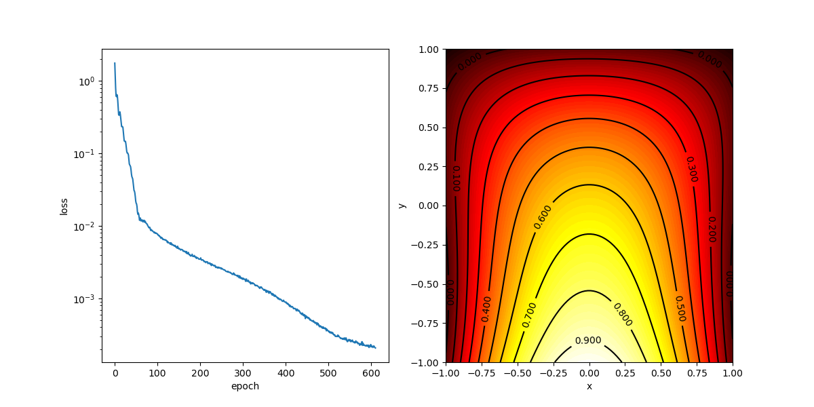
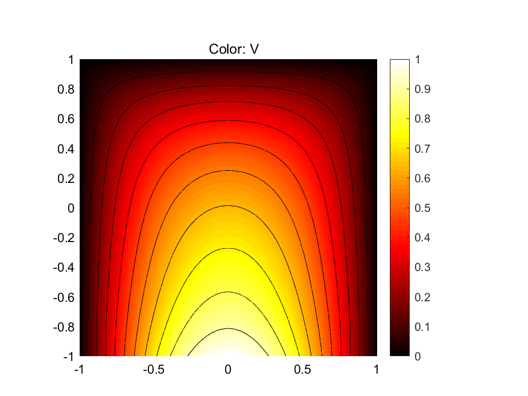
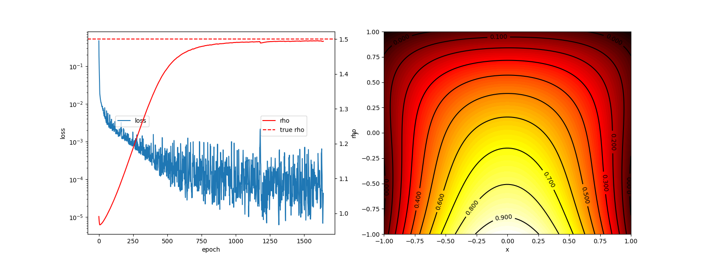

# PINN_simple_demo
A simple demo of Physics-Informed neural network with PyTorch for Posson's Eq. Containing both solution and parameter discovery.

## Solution of Posson's Eq.
To solve Poisson's equation with PINN.

Poisson's equation: $(d^2/dx^2 + d^2/dy^2) \phi = \rho(x, y)$, where $\rho(x, y) = 1.5$ for all $x, y$.

Domain: $x \in [-1, 1], y \in [-1, 1]$,
boundary conditions: $\phi(x, -1) = cos(pi * x / 2), \phi(x, 1) = \phi(\pm 1, y) = 0$.

In PINN, we define: $f = (d^2/dx^2 + d^2/dy^2) \phi - \rho(x, y) \to 0$.

### The training curve and solution by PINN

### Reference solution by MATLAB

## Parameter discovery
To discover the parameter $\rho(x, y)=1.5$ in Poisson's equation with PINN.

Poisson's equation: $(d^2/dx^2 + d^2/dy^2) \phi = \rho(x, y)$, where $\rho(x, y) = 1.5$ for all $x, y$, but we don't know it.

Domain: $x \in [-1, 1], y \in [-1, 1]$,
boundary conditions: $\phi(x, -1) = cos(pi * x / 2), \phi(x, 1) = \phi(\pm 1, y) = 0$.

5000 data points are generated by the solver of Poisson's equation with PINN.

The losses for parameter discovery are:
    
    loss_f = (d^2/dx^2 + d^2/dy^2) \phi - \rho(x, y)
    loss_data = \phi(x, y) - \phi_data(x, y)

### The training curve and solution of parameter discovery

